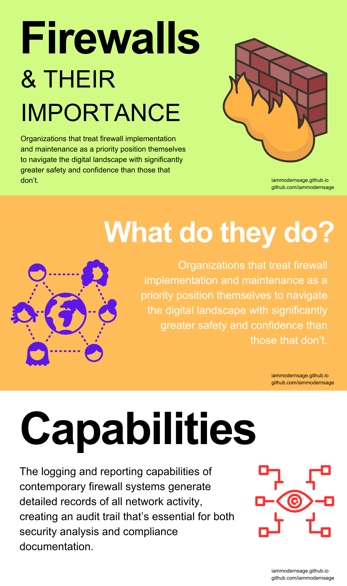

This is an open source & a free for all web application firewall program.

 ## Intro

  - The objective of this project to protect web applications across the Internet from looming cyber threats
  - The market for WAF is a bit dull and annoying, which makes many developers, and Cyber Security Researchers anxious.
  - This project shall work on filling in the gaps that make web applications vulnerable to cyber threats
  - It's a well established fact that developing a 100% secure application is just a hoax. Hence, this project focuses on making applications a safe ground for users, there can be much more aspects to it; for now, I am leaving at it.

 ## Features 

(This is just a pilot, the project is under development, the original features will include many more functionalities)

  - This project is written in C & python (majorly).
  - It is a modular, lightweight, open-source firewall that anyone can freely integrate into their own web applications, servers, or frameworks.
  - The project will be easy to extend via Python plugins.
  - It should have command-line usage and should be API ready.
  - No telemetry, no lock-in (Need to work a bit more on this one).

--------------------------------

 

--------------------------------

## Initial Release 27/06/2025

 - The initial phase of this project has been completed, which includes basic structure & reliable functionalities of the firewall.
 - There are more advanced features available with this project which needs to be integrated. All the files can be found in their respective folders (see developer guide for more info).
 - The main focus areas of this project will now be decentralization, addition of advanced features like blocking of various cyber threats, & much more (need to work on a few things first: like AI & ML).
 - Basic features for decentralization do exist in the current phase, but it is a standalone feature for now.

## Features of FireWall-FFA (FFA means Free For All):

 - TLS inspection with JA3 fingerprinting.
 - DNS & SNI filtering.
 - IP reputation & Threat Intelligence.
 - Edge proxy with HTTP/2, HTTP/3 QUIC support.
 - YAML/JSON log outputs.
 - Plugin SDK for rule extensions.
 - Full API access to all components. (WIP)
 - Self-hosted or edge-deployed.

## Modules:

| Module | Description |
|--------|-------------|
| core-engine | Handles all security decision-making & rule enforcement | 
| traffic inspector | Parses TLS Handshakes, SNI, & protocol metadata |
| rule engine | Extensible DSL or Suricata compatible rule support |
| plugin sdk | Easily build and load custom modules |

## To Install:

$ git clone https://github.com/iammodernsage/FireWall-FFA.git

$ cd FireWall-FFA

$ make all

$ python cli-tool/firewallctl.py start

-----------------------------------------

- Control the firewall using:
 $ firewallctl.py start
 $ firewallctly.py stop
 $ firewallctl.py status
 $ firewallctl.py reload

-----------------------------------------

- Install Systemd Service:
 $ bash scripts/install.sh
 $ y
 $ sudo systemctl start FireWall-FFA
 $ sudo systemctl enable FireWall-FFA
 $ sudo systemctl status FireWall-FFA *

-----------------------------------------

## Default Rule Set

 - FireWall-FFA ships with built-in rules for:
  - SQLi
  - XSS
  - Path Traversal
  - JA3 hash-based fingerprint detection
  - SNI based domain blocking

-------------------------------------------

## Extend or Replace rules using

 - rule-engine/parser.py
 - config/default.yml
